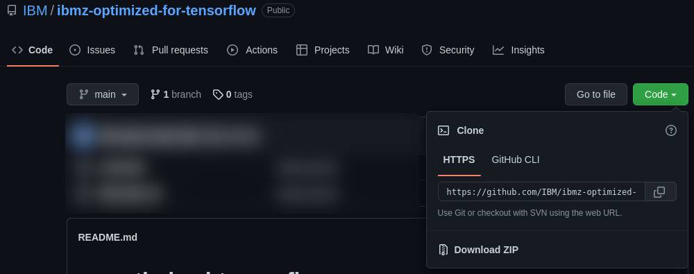

# Download and Setup Instructions

There are a few ways you can download the samples to run in the IBM Z Optimized for TensorFlow container. You can clone this repository with an installed [git](https://git-scm.com) client, download it as a zip, or download individual files using the Github web interface. With a git client you can clone this repository directly onto an IBM Z&reg; system or from inside the container if your local policies allow Internet access.

You might already be familiar with these techniques. These instructions are the same for any Github repository or docker container.

## Download Files

Choose one of the following options.

### Option 1. Clone the Entire Repository

This option will give you access to the samples, but will download additional files (e.g this document) that you might not need. Running the `git pull` command will download updates that are later made to the repository.

A git client must be installed on your workstation, on an IBM Z system or installed in the IBM Z Optimized for TensorFlow container, and Internet access to github.com.

From the [home page](https://github.com/IBM/ibmz-optimized-for-tensorflow) for this repository you can click the green 'Code' drop down button to show and copy the git clone uri for the repository. Add this uri to a `git clone` command to clone the repository into your current directory.



If the `git clone` was performed on your workstation, copy the files to the IBM&reg; Z system where you will run the container. Use scp, ftps or any file transfer solution available in your installation.

### Option 2. Download the Entire Repository

This option will give you access to the samples, but will download additional files you might not need. To get updates from the repository, repeat these instructions.

From the [home page](https://github.com/IBM/ibmz-optimized-for-tensorflow) for this repository you can click the green 'Code' drop down button. Click the 'Download ZIP' button to download the repository as a zip file.

Extract the zip file either on your workstation and copy the samples to the IBM Z system where you will run the container. Use scp, ftps or any file transfer solution available in your installation.

### Option 3. Download Sample Files Individually

This option will give you access to the samples and not download extraneous files. However, each file must be downloaded individually. To get updates from the repository, repeat these instructions.

Go to the sample file in the Github web interface and download it with one of the following:

- Click the 'Raw' button to view the contents of the file only. Then either:
  - Right click and select 'Save Page As...' (might be different in your web browser) to save the sample to  your workstation.
  - Select the entire contents of the file, copy it, and then past the content to a file editor on your workstation.
- Right click the 'Raw' button in the github web interface and select 'Save Link As..'  (might be different in your web browser) to download the content as a file.

## Make the Samples Available to the Container

If you have used `git clone` inside of the IBM Z Optimized for TensorFlow container, `cd` to the directory containing the sample files.

Otherwise, we assume the repository or just the samples are now copied onto the IBM Z environment that hosts the IBM Z Optimized for TensorFlow container.

One way of making host files available inside of a container is a [bind mount](https://docs.docker.com/storage/bind-mounts/). This shares the files between the host and the container. Changes to the files made on the host or in the container are available to both. To use a bind mount, specify the `-v` parameter with the name of a host directory or file, and the name of the directory or file as it should appear inside the container. This parameter must be supplied when the container is first started with `docker run`.

```bash
# The README files in the samples will use this variable when
# referring to the container image.
IMAGE_ID=icr.io/ibmz/ibmz-optimized-for-tensorflow:1.01

# Share samples with a bind mount. Adjust the paths if needed
# for the download directory you used.
docker run -it -v ~/ibmz-optimized-for-tensorflow/samples:/samples:z $IMAGE_ID /bin/bash
```

Another way is to use `docker cp` to copy the files into the container. For this technique, the container must already be running via `docker run`. You might need to open a second shell to the host system, or use <kbd>Ctrl</kbd><kbd>P</kbd><kbd>Ctrl</kbd><kbd>Q</kbd> to detach from the running container to get back to the host shell.

```bash
# To find the generated ID or name of the running container use:
docker ps

# Adjust the paths if needed for the download directory you used.
docker cp ~/ibmz-optimized-for-tensorflow/samples <container_id_or_name>:/samples

# If you detached from the running container, get back to it with.
docker attach <container_id_or_name>
```

# Training on CPU

Some of the samples, or your own TensorFlow applications, will train models. Generally, training should work with the IBM Z Optimized for TensorFlow container. However, our testing has focused more on inference, and problems could arise during the Open Beta.

If you have any issues training models, you can disable the IBM Integrated Accelerator for AI optimizations for training by setting the following environment variable:

```bash
# This will cause IBM Z Optimized for TensorFlow to target the CPU for all operations.
# This might resolve training problems.
export ZAIUDEVICES=0

# Run the training script or workload. 
# Some samples might not have such a script and instead download 
# a model from the Internet.
python ....

# When training is complete, unset the variable to enable 
# inference optimizations.
unset ZAIUDEVICES

# Run the inference script or workload
python ....
```

If problems persist, this might indicate a problem with how the model is constructed, or it might be a TensorFlow issue.

# Running the Samples

See the README.md file included with the sample for additional setup instructions and for the commands to run them.

Currently there is one sample available:

[Fashion MNIST](fashion-mnist)

# Saving Models or Code changes

By default, any changes you make inside of a container are lost when you exist the container.

By using bind mounts and performing your work in that mount inside the container, the models or code changes made in that directory will still be available on the host, and thus not lost when you exit the container.

Data that Tensorflow downloads into the container will be stored under `/root/.cache`.

You could also manually copy files or directories of interest with the `docker cp` command to preserve them.

You may also save the changes you made in a container by using [docker commit](https://docs.docker.com/engine/reference/commandline/commit/) to save the container as an image. The entire state of the container, software installed, etc will be retained. But note that directories and files made available ot the container via bind mounts will not be saved. However you can use `-v` to bind mount thata data again in the new container image.
